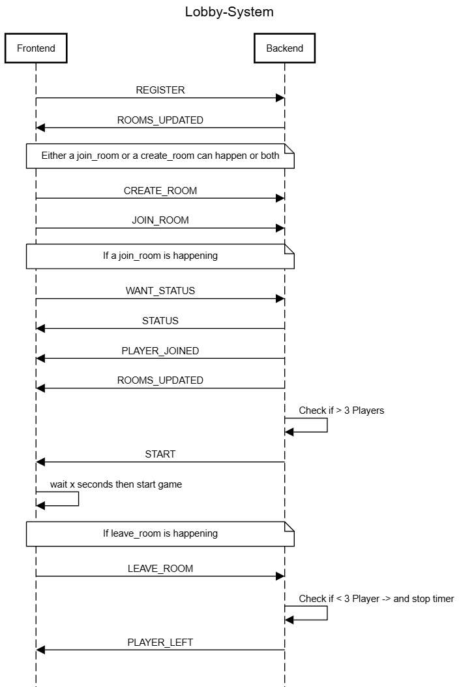
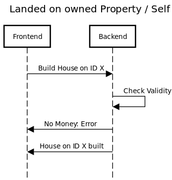

# Perropoly Game Actions

## Inhaltsverzeichnis
1. [Lobby-System](#lobby-system)
2. [Auktion](#auktion)
3. [Häuser bauen](#häuser-bauen)
4. [Unbebautes Grundstück kaufen](#unbebautes-grundstück-kaufen)
5. [Gefängnis](#gefängnis)
6. [Spieler hat gewonnen](#spieler-hat-gewonnen)
7. [Würfeln](#würfeln)
8. [Erfolgreiche Transaktion](#erfolgreiche-transaktion)
9. [Währungsübertragung im Schuldenmodus](#währungsübertragung-im-schuldenmodus)
10. [Währungsübertragung – Spieler bankrott](#währungsübertragung-–-spieler-bankrott)

## Lobby-System

## Auktion

## Häuser bauen

## Unbebautes Grundstück kaufen

## Gefängnis

## Spieler hat gewonnen

## Würfeln

## Erfolgreiche Transaktion

## Währungsübertragung im Schuldenmodus

## Währungsübertragung – Spieler bankrott

---
Diese Bilder können verwendet werden, um verschiedene Spielereignisse in einem Perropoly-ähnlichen Spiel darzustellen.